# Mis Mangas

> Práctica final del **Swift Developer Program 2026** (Apple Coding Academy). Nivel Premium.

App universal para explorar un catálogo de más de 64 000 mangas, buscarlos y filtrarlos, y llevar la colección propia (tomos comprados, tomo en lectura, series completas) con sincronización en la nube, una app companion para Apple Watch y un widget de lectura.

| Plataforma | Versión mínima | Qué hace |
|---|---|---|
| iOS / iPadOS | 27.0 | Catálogo, búsqueda y filtros, detalle, colección local y en la nube, cuenta, español e inglés |
| watchOS | 27.0 | Lista de lectura con portadas; subir o bajar el tomo en lectura; sincronizada con el iPhone |
| Widget (iOS) | 27.0 | Mangas en lectura y progreso en cinco familias (Home y pantalla de bloqueo); abre el detalle al tocar |

Swift 6 (modo estricto de concurrencia), SwiftUI, SwiftData, `URLSession`, WidgetKit, WatchConnectivity y Swift Testing. **Sin librerías de terceros.**

## Documentos de entrega

| Documento | Qué contiene |
|---|---|
| [Manual de usuario](Entrega/Manual%20de%20usuario%20-%20Mis%20Mangas.pdf) | Guía paso a paso para usar y evaluar la app (13 páginas): catálogo y filtros, búsqueda por título, autor y criterios, ficha y primera entrada en la colección, colección, tomos y progreso, sin conexión, cuenta y sincronización, Apple Watch, widgets, y ayuda y evaluación |
| [Mapa del proyecto](Entrega/Mapa%20del%20proyecto%20-%20Mis%20Mangas.pdf) | Diagrama de decisiones de alto nivel con los tres recorridos: acceso y navegación, guardado local y sincronización, reloj y widget |

La arquitectura, las decisiones y cómo compilar y probar están en este mismo README, más abajo.

## Capturas

| iPhone · Catálogo | iPhone · Detalle | iPhone · Mi colección | iPhone · Español |
|---|---|---|---|
| 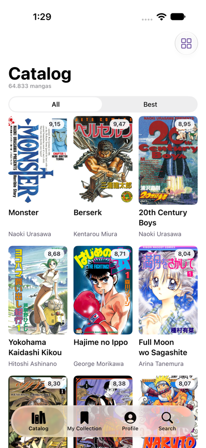 | 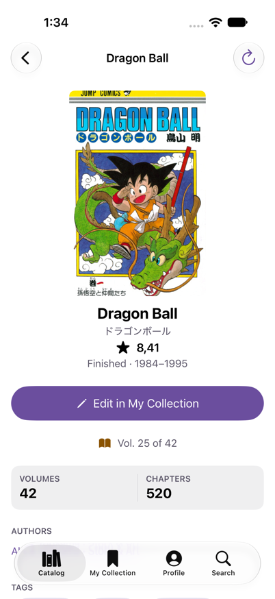 | 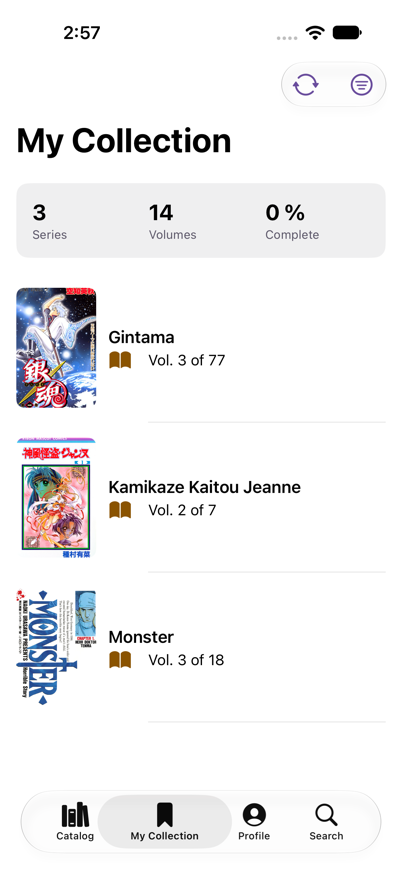 | 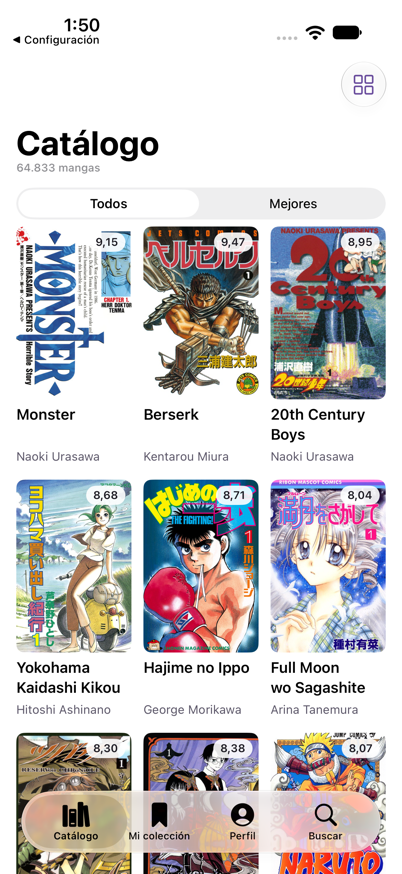 |

| iPhone · Filtro por género | iPhone · Editor de colección | iPhone · Perfil |
|---|---|---|
| 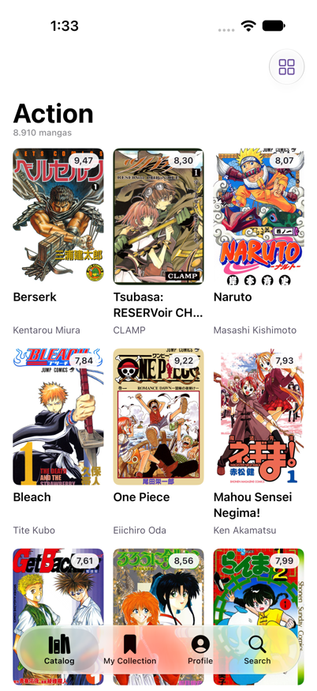 | 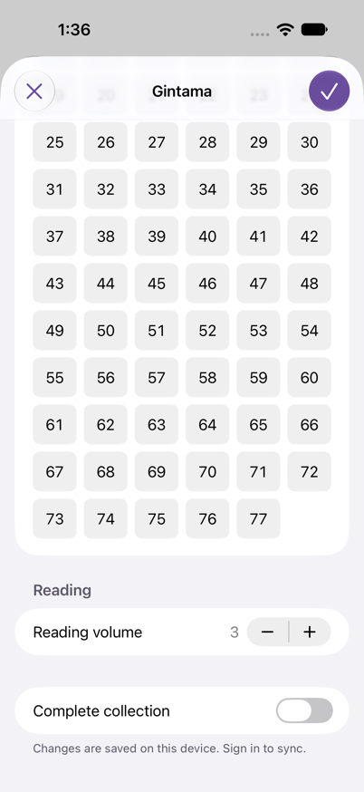 | 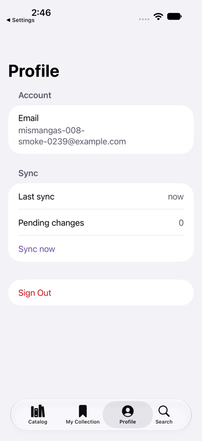 |

| iPad · Barra lateral y lista | iPad · Lista y detalle | iPad · Mi colección |
|---|---|---|
| 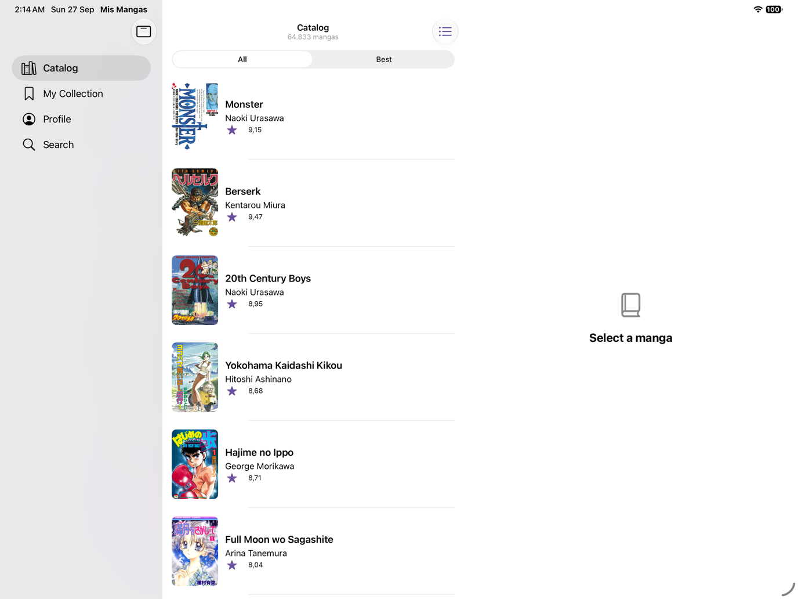 | 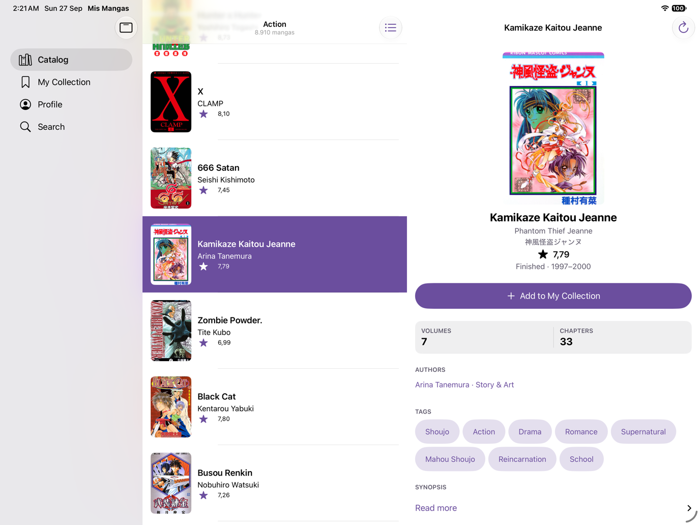 | 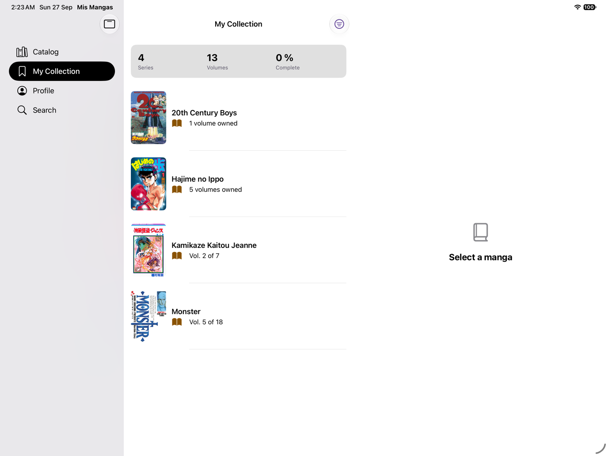 |

| Apple Watch · Lista de lectura | Apple Watch · Detalle | Widget · Home (medium y large) | Widget · Small | Widget · Pantalla de bloqueo |
|---|---|---|---|---|
| 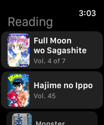 | 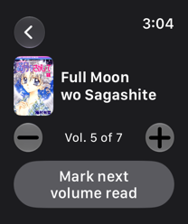 | 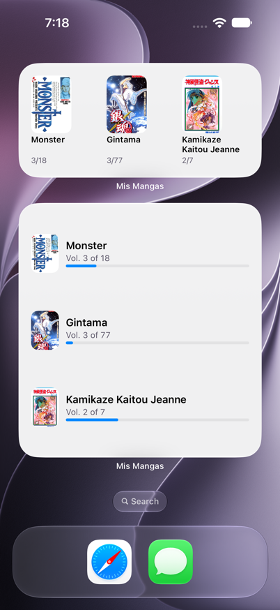 | 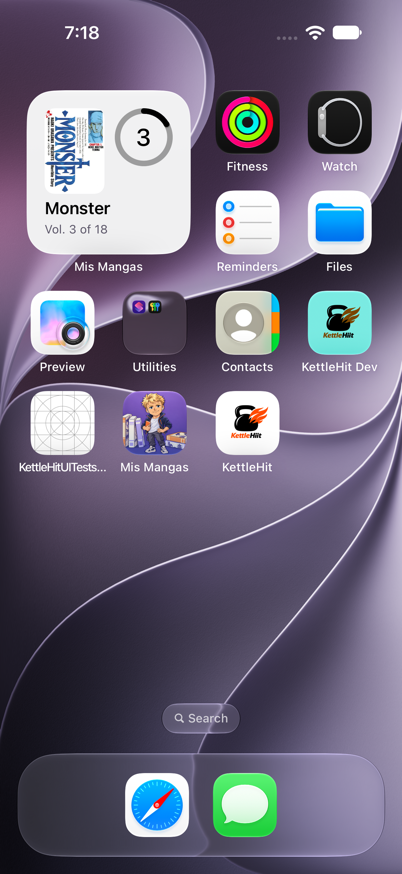 | 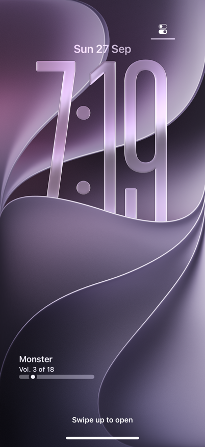 |

## Requisitos

- **Xcode 27** (toolchain Swift 6.2) con los simuladores de iOS 27 y watchOS 27.
- Acceso a la API de la práctica (`https://mymanga-acacademy-5607149ebe3d.herokuapp.com`). Solo el registro de usuarios necesita el `App-Token` de la academia; catálogo, búsqueda e inicio de sesión no.
- Un archivo `Secrets.xcconfig` local (no está en git). Se explica abajo.

## Puesta en marcha

1. Clonar el repositorio y abrir `Mis Mangas.xcodeproj`.
2. Crear el archivo de secretos a partir de la plantilla:

   ```bash
   cp "Mis Mangas/Config/Secrets.example.xcconfig" "Mis Mangas/Config/Secrets.xcconfig"
   ```

   Editar `Mis Mangas/Config/Secrets.xcconfig` y rellenar `APP_TOKEN` con el token de la API. El build lo expone a la app por la clave `AppToken` del `Info.plist`; nunca se escribe en código ni en logs. Sin él la app funciona (catálogo, búsqueda, colección local, inicio de sesión), pero el registro de cuentas nuevas falla.
3. Elegir el scheme y ejecutar (⌘R):

   | Scheme | Destino | Qué lanza |
   |---|---|---|
   | `Mis Mangas` | iPhone o iPad | La app (con la app del reloj y el widget embebidos) |
   | `Mis Mangas Watch App` | Apple Watch emparejado con un iPhone | La app del reloj |
   | `Mis Mangas WidgetExtension` | iPhone | El widget en la galería |

4. Tests (⌘U con el scheme `Mis Mangas`): el plan `Mis Mangas.xctestplan` ejecuta la suite de la app con cobertura activada; el scheme del reloj ejecuta la suya. Los tests no tocan la red: el transporte se sustituye por un `URLProtocol` con respuestas capturadas de la API.

Para usar la colección en la nube hace falta una cuenta: se crea desde la pantalla de bienvenida (email y contraseña de al menos 8 caracteres) o se entra con una existente. También se puede continuar sin cuenta: la colección se guarda en el dispositivo y se sube al iniciar sesión.

## Funcionalidades por nivel del enunciado

| Nivel | Qué incluye |
|---|---|
| **Básica** | Catálogo paginado (lista y rejilla) con portada, título, autor y puntuación; selector Todos / Mejores; detalle con portada, títulos alternativos, estado, años, tomos, capítulos, autores, géneros, temas, demografía y sinopsis; colección local (tomos comprados, tomo en lectura, colección completa); iPhone e iPad |
| **Media** | Filtros por género, tema, demografía y autor; búsqueda por texto con sugerencias; búsqueda avanzada combinada (título, autor, géneros, temas, demografías); etiquetas del detalle navegables |
| **Avanzada** | Registro e inicio de sesión reales; JWT de 24 h en Keychain con renovación proactiva; colección sincronizada con la nube mediante una cola de operaciones pendientes (outbox) y reconciliación determinista; modo invitado que se fusiona al iniciar sesión |
| **Deluxe** | App para Apple Watch (lista de lectura, subir o bajar tomo, sincronización bidireccional por WatchConnectivity); widget de lectura en cinco familias con deep link al detalle |
| **Premium** | Español e inglés (más español de Latinoamérica); accesibilidad WCAG 2.2 AA (VoiceOver, Dynamic Type hasta AX5, contraste medido, reducir movimiento); icono con Icon Composer y pantalla de arranque; 0 warnings; suite de 779 tests con cobertura por capa por encima de los umbrales |

## Arquitectura

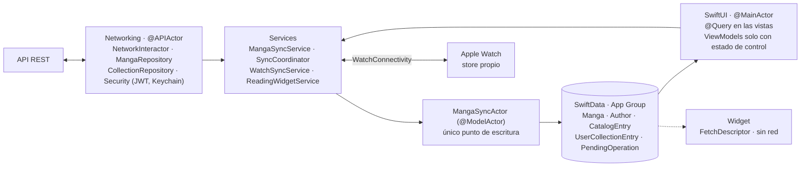

| Capa | Tipos principales | Aislamiento |
|---|---|---|
| Red | `NetworkInteractor`, `MangaRepository`, `CollectionRepository`, `SecurityData` / `Security`, `SecKeyStore` | `@APIActor` (Keychain: `Sendable`) |
| Orquestación | `MangaSyncService`, `SyncCoordinator`, `TaxonomyCacheActor`, `WatchSyncService`, `ReadingWidgetService`, `CoverCacheService` | `struct` sin estado / `actor` |
| Persistencia | `MangaSyncActor`, `PersistenceController`, `MangaSchemaV1`, cinco `@Model` | `@ModelActor` |
| Presentación | `SessionViewModel`, `CatalogViewModel`, `CollectionViewModel`, `MangaDetailViewModel`; vistas por pantalla en `Features/` | `@MainActor` |
| Puentes | `WatchSessionBridge` (`WCSession`), `ReadingTimelineProvider` (WidgetKit) | Impuestos por Apple |

Las ideas que lo sostienen:

- **SwiftData es la fuente de verdad de la UI.** Cada página del catálogo se persiste e indexa por modo de consulta (`CatalogEntry(modeKey, ordinal)`), así que las vistas leen con `@Query` en el orden del servidor y el catálogo ya visitado funciona sin red. El detalle se cachea 24 h.
- **Un único punto de escritura.** Solo `MangaSyncActor` escribe en el store; cada método es una transacción con un `save()`. Una edición de la colección guarda la entrada y su operación pendiente en la misma transacción.
- **Outbox como único canal hacia el servidor.** La sincronización drena las operaciones pendientes en orden (tres reintentos ante fallos de red o 5xx, bloqueo después) y luego aplica el snapshot remoto respetando lo que sigue pendiente. Cada operación recuerda la cuenta que la hizo: las de invitado se adoptan al iniciar sesión.
- **JWT de 24 h con renovación proactiva.** El token vive en Keychain (`AfterFirstUnlockThisDeviceOnly`); antes de cada llamada autenticada se valida `exp` en local y se renueva si le queda menos de 23 h. Nunca se reintenta tras un 401.
- **Reloj con store propio.** watchOS no comparte contenedores con el iPhone: el reloj recibe un snapshot de la lista de lectura por `applicationContext` y devuelve cada cambio por `sendMessage` y `transferUserInfo`.
- **Widget sin red.** Lee el mismo store por App Group con `FetchDescriptor` y `fetchLimit`; las portadas se dejan en una caché de ficheros compartida tras cada pase de sincronización y el widget se recarga entonces.
- **Swift 6 estricto.** `async/await` y actores; sin GCD, sin Combine, sin `@unchecked Sendable`. Dependencias explícitas a través de `AppDependencies`.

### Los cuatro flujos, en corto

- **Inicio de sesión y renovación.** `Security.login` hace `POST /users/jwt/login` con Basic, valida el `exp` del JWT recibido y guarda token y email en Keychain (`SecKeyStore`). Antes de cada llamada a `/collection`, `validToken()` lee el token: si le quedan menos de 23 h, llama a `POST /users/jwt/refresh` y guarda el nuevo; si está caducado o es ilegible, lo borra y la app vuelve a la pantalla de bienvenida. Al arrancar, `SessionViewModel.restoreSession()` intenta ese refresh; un fallo de red conserva la sesión, un rechazo del servidor la expira.
- **Colección y reconciliación.** Guardar en el editor llama a `MangaSyncActor.saveCollectionEntry`, que escribe la entrada y una `PendingOperation` en la misma transacción. `SyncCoordinator` serializa los pases de `MangaSyncService.synchronizeCollection()`: drena las operaciones pendientes de la cuenta activa en orden (`POST` o `DELETE /collection/manga`), reintenta tres veces los fallos de red o 5xx y bloquea después, descarta y reporta los 4xx, y expira la sesión ante 401/403; luego `GET /collection/manga` y `applyRemoteSnapshot`, que respeta los mangas con operación pendiente. Las operaciones hechas como invitado se adoptan al iniciar sesión y se envían primero.
- **Apple Watch.** `WatchSyncService` publica un `ReadingSnapshot` (hasta 50 mangas en lectura) por `updateApplicationContext` al activar la sesión, al recuperar alcance y tras cada pase de sincronización. El reloj lo aplica en su propio store entrada por entrada y devuelve cada cambio como `ReadingUpdate` por `sendMessage` y `transferUserInfo`; el iPhone lo aplica solo si es posterior a la última edición y encola una sincronización.
- **Widget.** Tras cada pase, `ReadingWidgetService` lee los seis mangas en lectura más recientes, deja sus portadas como JPEG en la caché del App Group (`CoverCacheService`) y llama a `WidgetCenter.reloadTimelines`. `ReadingTimelineProvider` abre el mismo contenedor y consulta con `FetchDescriptor` y `fetchLimit`; no tiene red. Tocar el widget abre `mismangas://manga/{id}`, que `MangaDeepLink` valida y `MyCollectionView` resuelve.

### Qué no hay, y por qué

| Ausente | Motivo |
|---|---|
| Cliente HTTP abstracto, `Endpoint`, interceptores | `URLSession` más un protocolo de tres métodos cubre todo; un interceptor reactivo a 401 sobra cuando el cliente lee `exp` y renueva antes |
| `UseCases`, `Stores`, entidades paralelas | Los `@Model` son el dominio; los servicios existen solo donde red y persistencia deben orquestarse juntas |
| Combine, GCD, completion handlers | Swift 6 estricto con `async/await`; las dos excepciones (`WCSessionDelegate`, `TimelineProvider`) las impone Apple |
| `ObservableObject`, `NavigationView`, routers propios, detección de dispositivo | `@Observable`, `NavigationStack`, `NavigationSplitView` adaptativo y `TabView` con `.sidebarAdaptable` |
| App Group o Keychain compartidos con el reloj | watchOS no comparte contenedores con el iPhone |
| CloudKit, librerías de terceros | La nube es la API de la práctica; solo frameworks de Apple |
| XCTest, tests de UI | Swift Testing; la interfaz se verifica con `#Preview` y en simulador |

## Decisiones de arquitectura (resumen)

| Tema | Decisión |
|---|---|
| Stack | Swift 6 estricto, SwiftUI, SwiftData, Swift Testing, sin terceros |
| Identificadores | bundle `cloud.manuelalvarez.Mis-Mangas`, App Group solo app + widget, sin Keychain Sharing |
| Capa de red | `@APIActor` + `NetworkInteractor` + `URLRequest.request(token:)`; sin cliente HTTP abstracto |
| Persistencia | Arranque del `ModelContainer` con `Result`, sin `fatalError`; contenedor en memoria para previews y tests |
| Colección | Reconciliación: outbox único canal, escrituras atómicas del actor, operaciones con dueño |
| Apple Watch | WatchConnectivity + store propio |
| Previews | Datos de muestra en `PreviewContainer`, con red real para las portadas |
| Widget | caché de portadas en el App Group, recarga por pase, deep link `mismangas://manga/{id}` |
| Catálogo | Persistido con índice por modo; las vistas reciben solo `Manga` |
| Sistema visual | diez tokens de color en cuatro apariencias, rejilla con badge de puntuación |
| Navegación | `NavigationSplitView` adaptativo para lista/detalle; la lista es dueña de la selección; formularios como hojas con `NavigationStack` |
| Autenticación | JWT de 24 h de `/users/jwt/*` en Keychain con renovación proactiva (la colección rechaza el token de sesión) |

## Idioma

La app, la app del reloj y el widget están en **inglés y español** (con variante `es-419`) y siguen el idioma del sistema. Para usar otro idioma solo en Mis Mangas: Ajustes → Apps → Mis Mangas → Idioma; la app no tiene selector propio. Los datos que vienen de la API (títulos, sinopsis, autores, géneros, temas y demografías) se muestran tal como los entrega, en inglés, en ambos idiomas.

Los textos se escriben en inglés literal en el código y el build los extrae a `Localizable.xcstrings`; las traducciones se añaden en el editor de Xcode.

## Accesibilidad

Auditada pantalla por pantalla con criterios WCAG 2.2 AA:

- Etiquetas y pistas en cada control; filas de lista combinadas en un solo elemento; imágenes decorativas ocultas; rasgos de cabecera y de selección en chips y cabeceras.
- Dynamic Type verificado hasta AX5 en catálogo, detalle, editor y colección (la rejilla de tomos recalcula su altura al cambiar el tamaño).
- Contraste ≥ 4,5:1 medido en píxel para cada token de color en claro, oscuro y contraste aumentado; encabezados y pies de formulario con color propio.
- Anuncios de VoiceOver al guardar, borrar y fallar el registro; "Reducir movimiento" cambia el zoom por un fundido; "Reducir transparencia" hace opacas las capas de carga.

## Rendimiento

Instrumentado con `OSSignposter` (intervalos `app.launch`, `catalog.page`, `detail.open`, `sync.collection`, `widget.timeline`). Medido: sincronización de 50 entradas en 0,025 s y de 500 en 0,396 s (test de rendimiento con transporte simulado); el widget con seis portadas usa 3 MiB persistentes. Las portadas pasan por una caché en memoria de 50 MB con descargas deduplicadas y canceladas al desaparecer la celda. El detalle sirve desde el store cuando la caché tiene menos de 24 h. Arranque en frío, scroll y apertura del detalle no se midieron con Instruments en esta entrega; los intervalos están listos para hacerlo.

## Tests

- **Swift Testing** (`@Test`, `#expect`, `#require`): 735 tests en la app y 44 en el reloj, todos verdes, sin XCTest ni tests de UI.
- **Sin red real.** `URLSessionMockInterface` (`URLProtocol`) responde con fixtures JSON capturadas de la API; los tokens de prueba se generan en el test. Se ejecuta el pipeline completo (petición → decodificación → mapeo → persistencia) con transporte simulado.
- **Persistencia real en memoria.** Los tests del actor y de los servicios usan el `MangaSyncActor` de producción sobre un contenedor en memoria y comprueban el resultado con una lectura fresca del store.
- **Cobertura por carpeta** (umbrales del proyecto entre paréntesis): Networking 91 % (85), Repositories 99 % (85), Services 95 % (80), Persistence 87 % (80), ViewModels 95 % (75). Excluidos por depender de frameworks no simulables: `SecKeyStore`, `WatchSessionBridge`, `ReadingTimelineProvider`.

## Estructura del repositorio

```
Mis Mangas/                 app iOS/iPadOS: App/ · Domain/ · Networking/ · Repositories/ · Persistence/ · Services/ · ViewModels/ · Features/ · Components/ · WatchConnectivity/ · WidgetSupport/ · Diagnostics/ · Preview/ · Resources/ · Config/
Mis MangasTests/            suite de la app (Swift Testing), fixtures en Resources/, dobles en Support/
Mis Mangas Watch App/       app watchOS (comparte por membresía dominio, esquema, actor y puente)
Mis Mangas Watch AppTests/  suite del reloj
Mis Mangas Widget/          Widget Extension (`Mis Mangas WidgetExtension`)
Screenshots/                capturas de iPhone, iPad, Apple Watch y widget que usa este README
Entrega/                    manual de usuario y mapa del proyecto (PDF)
```

## Créditos

- API y enunciado: **Apple Coding Academy** (Swift Developer Program 2026).
- Autor: Manuel Alvarez.
